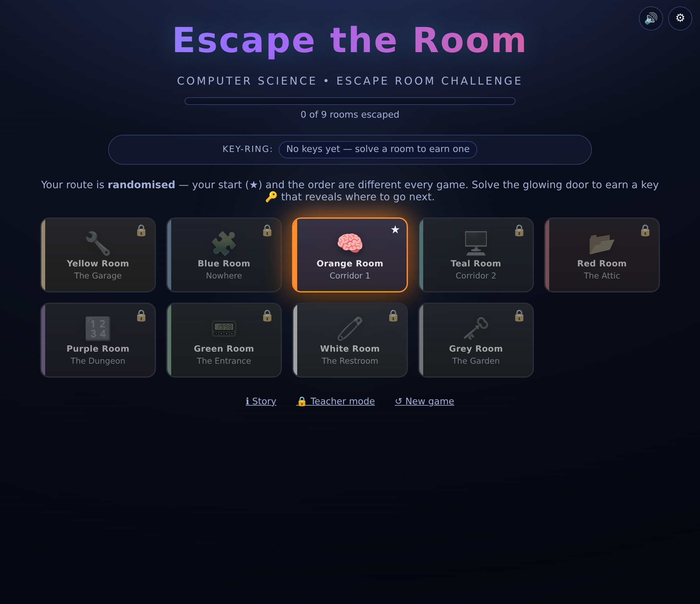
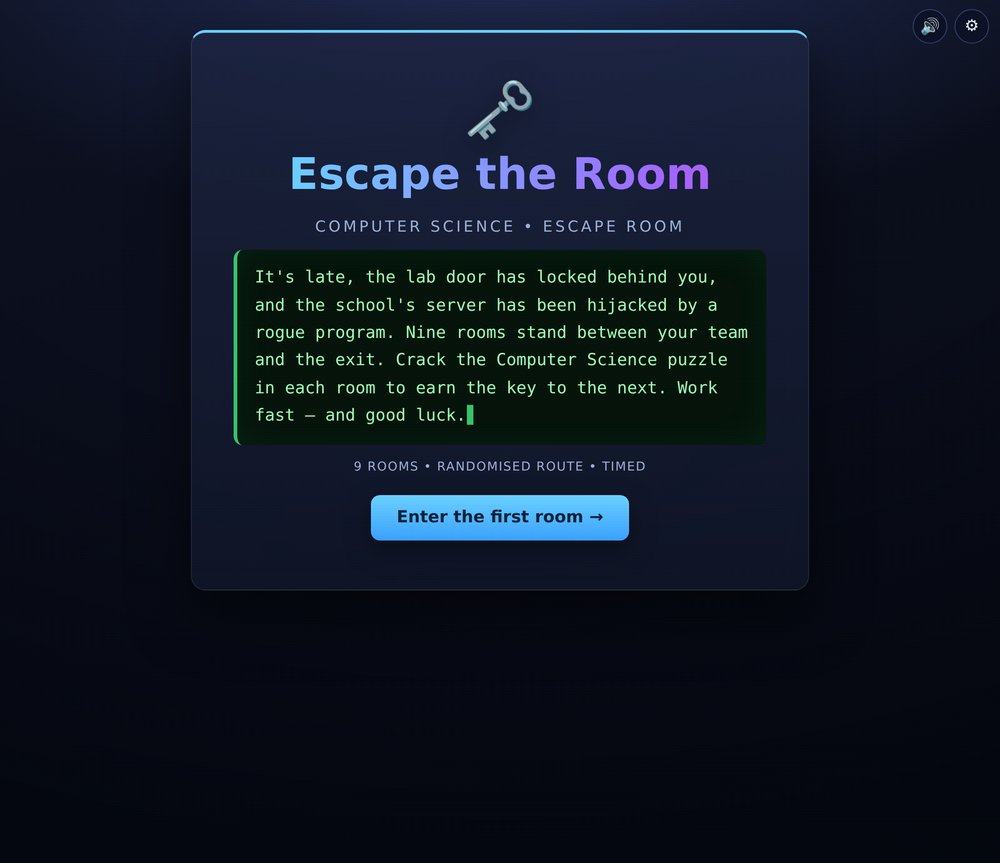
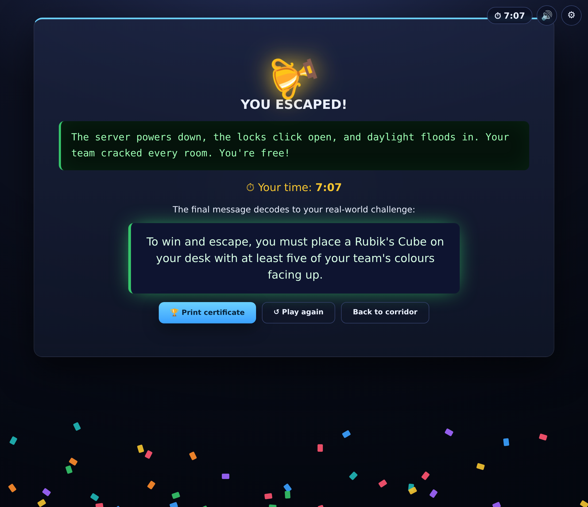
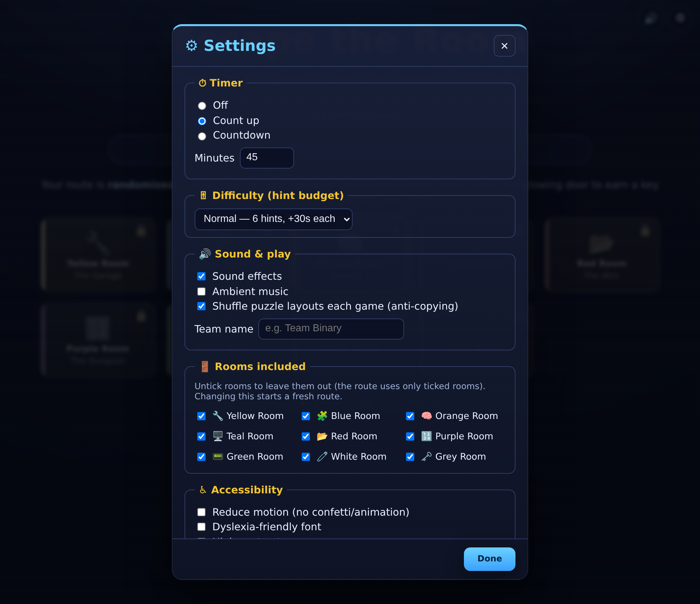

# 🗝️ Escape the Room — Computer Science

An **interactive, browser-based escape-room challenge** for the classroom.
Pupils work through nine themed rooms. Each room contains a hands-on puzzle
(drag-and-drop, click, type, decode…). Solving a room earns a **key 🔑** that
unlocks the next door — and cracking the final room reveals how to *escape*.

No installation, no accounts, no internet required — it's plain HTML/CSS/JS. You
can **double-click `index.html`**, drop it on a school network share, host it free
on **GitHub Pages**, or **install it as an offline app** on classroom tablets.



## ✨ What's inside

- 🎬 **Cinematic visuals** — a live particle-network background, neon glassmorphism
  panels, a **terminal boot intro**, glowing 3D doors, light-flash room transitions
  and a fireworks finish (all GPU-light and reduce-motion-aware).
- 🔒 **Password-protected Teacher mode** so pupils can't reveal answers.
- 🎲 **Randomised route** — a random start (★) and room order on every device.
- ⏱ **Timer** — count-up or a countdown limit; the team's time shows on the win screen.
- 📜 **Story intro & outro** that wrap the nine rooms into one adventure.
- 🔊 **Sound effects + optional ambient music** — synthesised in the browser (no files), fully toggleable.
- 🔀 **Per-game puzzle shuffling** — anagrams, codes, the cipher shift and more differ per device to beat copying (the *answers* stay the same).
- 🏆 **Printable certificate** with the team name and time.
- ⚙ **Teacher settings** — timer, difficulty, sound, team name, and which rooms to include.
- 💡 **Hint economy** — a hint budget and time penalty set by difficulty.
- ♿ **Accessibility** — keyboard play, screen-reader labels, reduce-motion, dyslexia-friendly font, high-contrast, colour-blind-safe doors and text sizing.
- 📲 **Installable & works fully offline** (PWA).

| Terminal boot intro | The escape 🎉 |
|---|---|
|  |  |

---

## ▶️ How pupils play

1. The **corridor** shows nine coloured doors. The **starting room is random**
   (marked ★) and only the glowing door is open.
2. Click the open door and solve the puzzle inside.
3. Solving it reveals a **key** that unlocks the next room on your **randomised
   route** — every device gets a different order.
4. Keep going until **every room is solved** — then you escape! (The Grey Room's
   cipher reveals the final real-world challenge.)

Because the route is shuffled per device, neighbouring groups can't simply copy
each other's "next answer". Progress and the route are saved automatically in the
browser, so a pupil can close the tab and come back. *Reset* gives a fresh random
route.

## 🚪 The nine rooms

| # | Room | Puzzle | Skill |
|---|------|--------|-------|
| 1 | 🟡 Yellow — The Garage | **Anagrams** — unscramble wheels, flag 2 spares | Networking terms |
| 2 | 🔵 Blue — Nowhere | **Letter elimination** — cross out letters | Cyber-security vocab |
| 3 | 🟠 Orange — Corridor 1 | **Crossword** | CPU, registers & memory |
| 4 | 🟢 Teal — Corridor 2 | **Spot the error** — find buggy code | Python debugging |
| 5 | 🔴 Red — The Attic | **Match** terms to definitions (drag & drop) | Operating-system functions |
| 6 | 🟣 Purple — The Dungeon | **Sudoku** → 6-digit code | Logic & problem solving |
| 7 | 🟩 Green — The Entrance | **Code-breaker** — ASCII / Hex → text | Character encoding |
| 8 | ⬜ White — The Restroom | **Jigsaw** — rebuild split words (drag & drop) | CS terminology |
| 9 | ⬛ Grey — The Garden | **Shift (Caesar) cipher** | Cryptography |

Every room also has an optional **bonus riddle** for early finishers.

The puzzles are based on the *Escape the Room – Computer Science* printable pack,
rebuilt as fully interactive activities. Touch-friendly, so they work on tablets
and interactive whiteboards as well as laptops.

---

## 👩‍🏫 For the teacher

* **⚙ Settings** (top-right): set the **timer** (off / count-up / countdown),
  **difficulty** (the hint budget), **sound**, a **team name**, and **which rooms**
  to include — plus all the accessibility options.
  
* **Teacher mode** (corridor footer) is **password-protected** so pupils can't open
  it. Once unlocked it adds **👁 Reveal** and **⏭ Skip** buttons in every room, plus
  a **🖨 Print answer key** cheat-sheet. *(The password is stored only as a hash in
  `js/engine.js` — change `TEACHER_HASH` to set your own.)*
* **Answer key:** [`TEACHER_GUIDE.md`](TEACHER_GUIDE.md) lists every solution, key
  and bonus answer. *With "Shuffle puzzle layouts" on, the exact letters/positions
  vary per device but the answers are identical — use **Reveal** on a given device.*
* **Certificate:** the win screen has a **🏆 Print certificate** button (team + time).
* **New game:** *↺ New game* gives a fresh random route and re-shuffles the puzzles.
* **The final escape** decodes to a real-world team task (a Rubik's-Cube challenge).
  Edit `GAME.escapeMessage` and `GAME.story` in `js/data.js` for your own finish.

### Hosting it for your class (free)

**Option A — just share the files.** Put the whole folder on your shared drive /
VLE and tell pupils to open `index.html`.

**Option B — GitHub Pages (a shareable link).**
1. Make sure the app is on your `main` branch.
2. Repo **Settings → Pages → Build and deployment → Source: "Deploy from a
   branch" → `main` / `(root)`**.
3. GitHub publishes the site at `https://<you>.github.io/csescaperoom/`
   (give it a minute on the first build).

**Option C — install it (offline app).** Open the site over https (e.g. GitHub
Pages) and use your browser's **Install** / "Add to Home Screen". It then runs
fully offline — handy for tablets with patchy Wi-Fi.

---

## ✏️ Customising the puzzles

All puzzle content lives in **`js/data.js`** — answers, clues, the sudoku grid,
the cipher, the room keys and the bonus riddles. It's heavily commented; you can
change wording or answers without touching any other file. The matching engine,
validation and styling all read from that one file.

## 🛠️ Project layout

```
index.html             the page (loads the scripts below)
css/styles.css         styling, themes, print & accessibility styles
js/data.js             puzzle content, answers, story & defaults  ← edit me
js/rng.js              seeded RNG for per-game puzzle shuffling
js/sound.js            synthesised sound effects (Web Audio, no files)
js/fx.js               visual effects — particle bg, flashes, fireworks, typewriter
js/settings.js         teacher settings + the ⚙ modal
js/dragdrop.js         touch + mouse + keyboard drag-and-drop
js/puzzles.js          the nine interactive puzzle types
js/engine.js           story, corridor, timer, hints, certificate, progress
manifest.json, sw.js   offline PWA (web-app manifest + service worker)
assets/                app icons
TEACHER_GUIDE.md       full answer key
_test/                 developer smoke-tests (not needed to play)
```

## ✅ For developers

A headless smoke-test renders every room, auto-solves it and checks the result:

```bash
npm install        # installs jsdom (dev only)
npm test           # node _test/harness.js
```

`_test/shots.js` captures screenshots with Playwright if you want to regenerate
the images in `docs/`.
